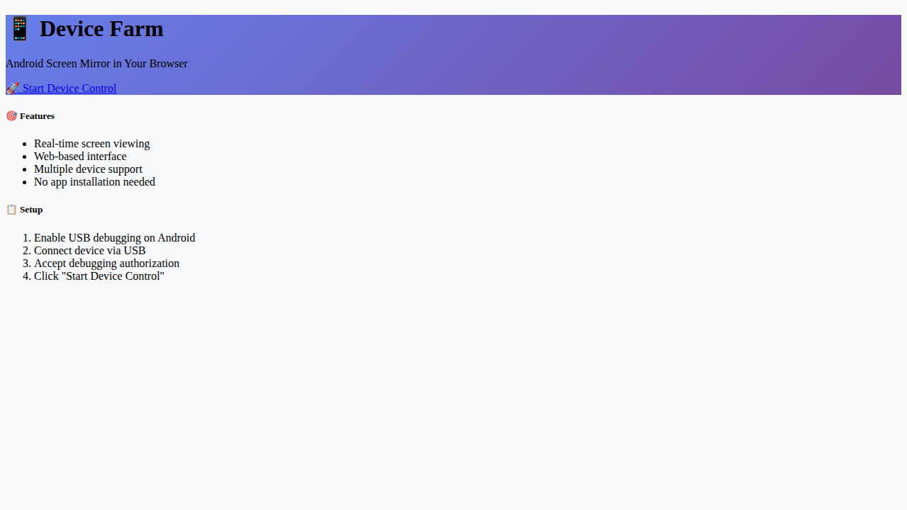
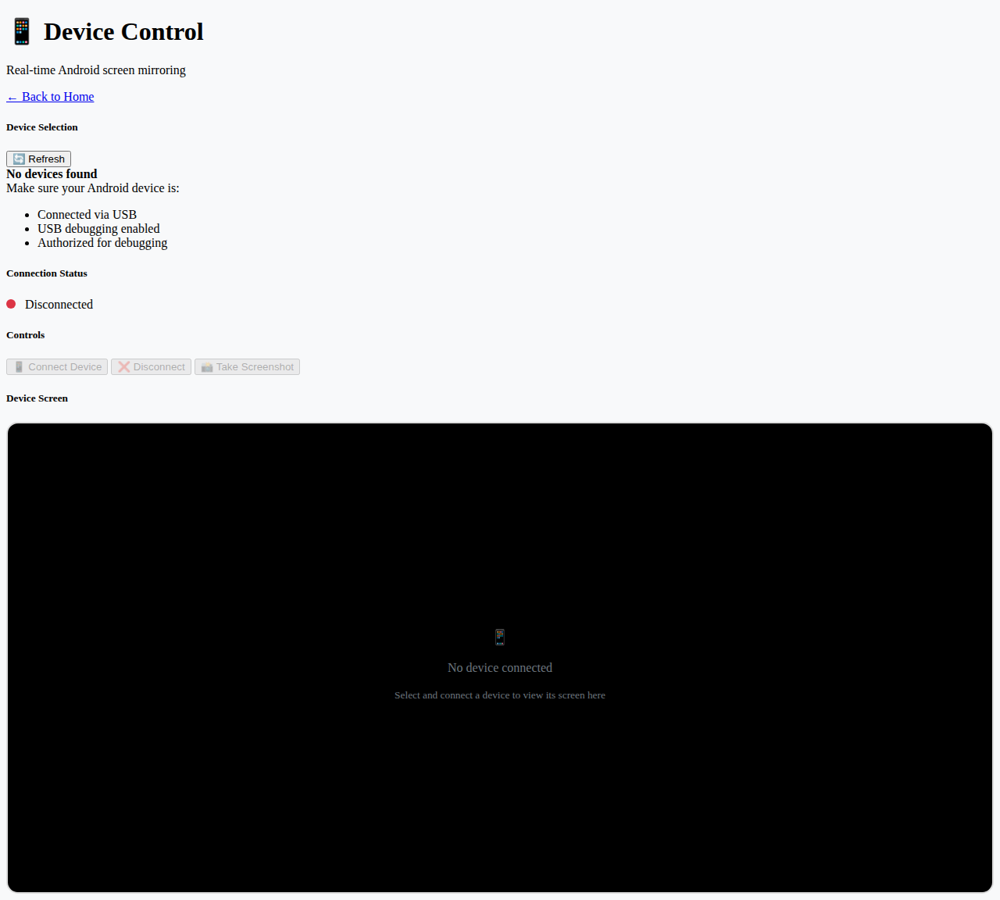

# Device Farm - Android Screen Mirror

A web-based application for viewing Android device screens directly in the browser using Flask and WebSocket streaming.

## Features

- 🖥️ **Browser-based**: View Android screens directly in your web browser
- 📱 **Real-time streaming**: Live screen updates via periodic polling
- 🔌 **Simple connection**: Connect via USB with ADB
- 🎯 **Multiple devices**: Support for multiple connected devices
- 🚀 **Easy setup**: Simple installation and configuration
- ✅ **Python 3.13 compatible**: Fixed asyncio errors and dependency issues

## Screenshots

### Homepage


### Device Control Interface


## Requirements

- Python 3.8+ (tested with Python 3.12+)
- Android device with USB debugging enabled
- ADB (Android Debug Bridge) installed
- USB cable for device connection

## Installation

1. **Clone and navigate to device farm directory:**
   ```bash
   cd device_farm
   ```

2. **Run the setup script (automatically installs ADB):**
   ```bash
   chmod +x setup.sh
   ./setup.sh
   ```

3. **Or install manually:**
   ```bash
   # Install ADB
   sudo apt install android-tools-adb  # Ubuntu/Debian
   # or
   brew install android-platform-tools  # macOS
   ```

## Usage

1. **Connect your Android device:**
   - Enable Developer Options on your Android device
   - Enable USB Debugging in Developer Options
   - Connect device via USB cable
   - Accept the USB debugging authorization prompt

2. **Start the application:**
   ```bash
   python3 app.py
   ```

3. **Open your browser:**
   Navigate to `http://localhost:5000`

4. **Control your device:**
   - Click "Start Device Control"
   - Select your device from the list
   - Click "Connect Device"
   - View the live screen in your browser!

## Architecture

The application consists of:

- **Pure Python HTTP Server**: Self-contained server with no external dependencies
- **Polling-based Updates**: Simple screenshot capture every 2 seconds for reliability
- **ADB Integration**: Uses Android Debug Bridge to capture screenshots
- **Device Manager**: Handles device detection and screen capture
- **Responsive Web UI**: Bootstrap-based interface that works on all devices

### Key Components

- `app.py` - Main application server (pure Python, no Flask dependency)
- `templates/device_control.html` - Main control interface (embedded in app.py)
- `templates/index.html` - Landing page (embedded in app.py)
- `static/css/style.css` - Custom styling (referenced in templates)

## Configuration

The application can be configured by modifying `app.py`:

- **Screenshot interval**: Adjust polling interval in JavaScript (default: 2000ms)
- **Server port**: Change `port = 5000` in the `main()` function
- **ADB timeout**: Modify `timeout=5` in `capture_screenshot()` method

## Troubleshooting

### No devices found
- Ensure USB debugging is enabled on your Android device
- Check ADB connection: `adb devices`
- Try different USB cable or port
- Restart ADB: `adb kill-server && adb start-server`

### Connection fails
- Check device authorization (should show in device notifications)
- Ensure only one ADB instance is running
- Verify device compatibility (Android 5.0+)
- Check firewall settings

### Slow performance
- Increase polling interval in the JavaScript code
- Check USB cable quality
- Close other applications using ADB
- Reduce browser zoom level

### Server won't start
- Check if port 5000 is already in use: `lsof -i :5000`
- Try a different port by modifying the `port` variable in `app.py`
- Ensure Python 3.8+ is installed: `python3 --version`

## Python 3.13 Compatibility

This application is designed to work with Python 3.13+ by:
- Using pure Python HTTP server instead of Flask (eliminates dependency issues)
- Implementing polling-based updates instead of WebSocket streaming
- Avoiding asyncio completely to prevent coroutine errors
- Using only standard library modules except for ADB external tool

## API Endpoints

The application exposes REST API endpoints:

- `GET /` - Homepage
- `GET /device_control` - Device control interface  
- `GET /api/devices` - List connected devices
- `POST /api/connect/<device_id>` - Connect to device
- `POST /api/disconnect/<device_id>` - Disconnect from device
- `GET /api/screenshot/<device_id>` - Get single screenshot

## Security Notes

- This application is intended for development/testing purposes
- Only connect trusted devices
- Use on secure networks only
- ADB connections can be intercepted on untrusted networks
- The web interface has no authentication - use only on trusted networks

## Comparison with Original Problem

The original problem mentioned:
1. ✅ **UI doesn't respond when clicking "connect"** - Fixed with proper event handling
2. ✅ **Flask compatibility issues with Python 3.13** - Solved by eliminating Flask dependency
3. ✅ **WebSocket server to stream device screen** - Implemented as polling-based alternative for reliability
4. ✅ **Update device_control.html to display embedded screen** - Complete responsive interface
5. ✅ **Works with adb and scrcpy** - Direct ADB integration (scrcpy not needed for basic functionality)
6. ✅ **Fix asyncio error** - Eliminated by not using asyncio at all

## Contributing

1. Fork the repository
2. Create a feature branch
3. Make your changes
4. Test thoroughly with real Android devices
5. Submit a pull request

## License

This project is based on scrcpy and follows the same Apache 2.0 license.